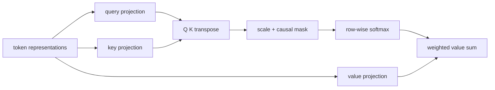

# Self-attention: weighted information routing

Scaled dot-product attention compares every query with every key, divides the
scores by the square root of the key dimension, normalizes each query row with
softmax, and uses those weights to mix the value vectors.



The implementation uses tensor matrix multiplication and softmax directly; it
does not call PyTorch's fused attention or multi-head attention functions. The
multi-head layer learns separate query, key, and value projections, splits the
embedding dimension into heads, applies the same tested primitive, concatenates
the results, and applies an output projection.

## Measured causal map

Run the fixed experiment with:

```bash
python -m tiny_transformer.experiments.attention
```

On 2026-09-26 it generated this attention map from three fixed two-dimensional
representations. Rows are queries and columns are keys.

| query / key | `the` | `cat` | `sat` |
| --- | ---: | ---: | ---: |
| `the` | 1.000000 | 0.000000 | 0.000000 |
| `cat` | 0.330238 | 0.669762 | 0.000000 |
| `sat` | 0.197776 | 0.401112 | 0.401112 |

Every row sums to `1.0`, and the total weight above the diagonal is `0.0`.
Those checks show normalization and causal isolation for this example. They do
not establish model quality.

## Interpretation limits

- A large weight shows how this calculation routed values; it is not a causal
  explanation of a model prediction.
- This map uses fixed, hand-written representations rather than learned
  language-model states, so it carries no linguistic-performance claim.
- Real Transformers distribute information across heads and layers. One map
  omits interactions and residual paths outside the selected head.
- Softmax weights are sensitive to projections, scaling, masks, and inputs.
  Similar-looking maps can produce different outputs when value vectors differ.
- A causal mask proves only that future positions receive zero weight. It does
  not prevent leakage introduced earlier by data preparation or training.
