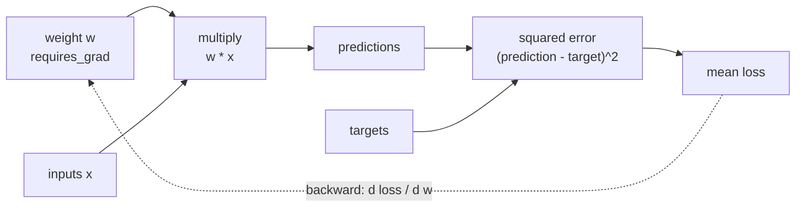

# Autograd: tracing a backward pass

The experiment fits one scalar weight in `prediction = weight * input` and
computes mean squared error against `target = 2 * input`. Because the weight
has `requires_grad=True`, PyTorch records the forward operations. Calling
`loss.backward()` walks that graph in reverse and accumulates the derivative in
`weight.grad`.



For this graph, the analytical derivative is:

```text
d loss / d weight = mean(2 * (weight * input - target) * input)
```

The test calculates that expression independently and compares it with the
gradient produced by autograd.

```bash
python -m tiny_transformer.experiments.autograd
```
