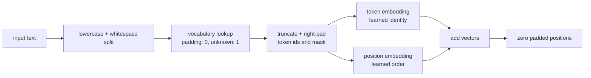

# Tokenizer and embeddings: ids become contextual positions

The pipeline separates four contracts so each boundary can be tested:



Vocabulary entries are ordered by descending frequency and then
alphabetically, making ties reproducible regardless of document order. The
reserved `<pad>` and `<unk>` entries always occupy ids 0 and 1. Unseen tokens
therefore remain explicit instead of being silently discarded.

Batch encoding retains each original sequence length while truncating and
right-padding to a configured width. Its boolean attention mask distinguishes
real tokens from padding. The embedding stack adds learned token and position
vectors, then zeros padded positions so padding does not leak positional
information downstream.

```bash
python -m tiny_transformer.experiments.embeddings
```

The fixed experiment includes an unseen token, a sequence longer than the
configured limit, and an empty sequence. It reports shapes, boundary counts,
zero-padding evidence, and the number of embedding-table rows reached by the
backward pass. These are implementation checks, not model-quality metrics.
