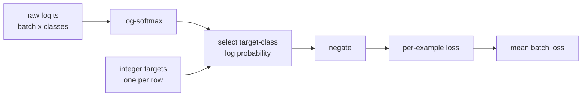

# Loss: cross entropy from raw logits

The loss experiment treats each row as one item with three possible classes.
The model emits raw logits: unbounded scores rather than probabilities. PyTorch
cross entropy combines `log_softmax` and negative log likelihood in one
numerically stable operation.



The code deliberately does not apply `softmax` before `cross_entropy`.
Pre-normalizing would duplicate work, reduce numerical stability, and change
the function's expected input contract.

```bash
python -m tiny_transformer.experiments.losses
```

The tests compare the result with the explicit formula, demonstrate invariance
to a constant shift of each logit row, and confirm that confidently wrong
scores increase the loss.
