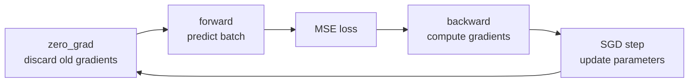

# Optimizers: one complete SGD training step

The optimizer experiment learns the fixed relationship
`target = 3 * input - 0.5` with a one-input linear layer. The layer starts from
known zero parameters, so repeated runs are directly comparable.



Order matters:

1. `zero_grad` prevents gradients from accumulating across unrelated batches.
2. The forward pass builds the computation graph and produces a loss.
3. `backward` fills each trainable parameter's gradient.
4. `step` applies the optimizer's update rule under `torch.no_grad` semantics.

```bash
python -m tiny_transformer.experiments.optimizers
```

The experiment reports the observed first and last loss rather than claiming a
result in advance. Tests verify convergence, repeatability, and clear errors
for invalid run settings.
