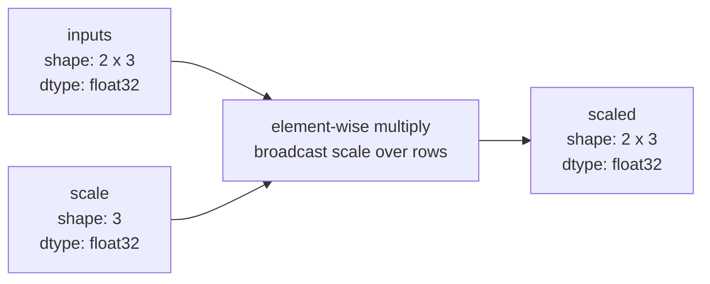

# Tensors: shape, dtype, and broadcasting

The first experiment creates a `2 x 3` floating-point matrix and multiplies it
by a length-three scale vector. PyTorch aligns the vector with the matrix's
last dimension, so the same three scale values apply independently to both
rows. Broadcasting changes neither input in place.



Run the executable example:

```bash
python -m tiny_transformer.experiments.tensors
```

The fixed local random generator makes the output reproducible without
changing PyTorch's process-wide random seed.
