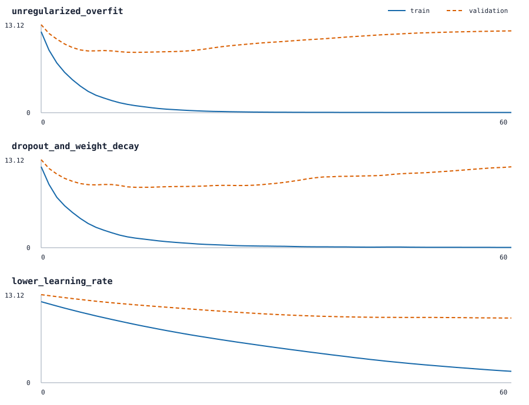

# Tiny language-model training

The training path joins the earlier concepts into a small causal language
model: token and position embeddings feed a pre-normalized attention block,
then a feed-forward residual path and a vocabulary projection. The projection
shares weights with the token embedding table.

```text
token ids -> embeddings -> causal attention -> feed-forward -> next-token logits
                                      ^
                           padding + future masks
```

## Data contract

The packaged corpus contains 24 independently authored, CC0-licensed lines.
Splitting happens at document level with a local random generator. A training
example may slide within one line, but never crosses into the next line. Inputs
are right-padded with token id `0`; missing targets use cross-entropy's `-100`
ignore index.

The validation documents remain separate from the six-document training subset
used by all three configurations. Building the vocabulary from the full corpus
exposes validation tokens to the vocabulary but not their order or targets.
This is acceptable for this mechanics demonstration, but it would be leakage
for a benchmark that claimed generalization to unseen vocabulary construction.

## Measured curves



The unregularized high-rate run reduced training loss from `12.0777` to
`0.0320`, while validation reached its minimum of `8.9956` at step 12 and rose
to `12.2000`. That widening gap is the intended overfitting example.

Adding dropout and weight decay slowed fitting and produced a slightly lower
final validation loss (`12.0564`), but its best validation loss (`9.0013`) did
not beat the unregularized run. The `0.003` learning-rate run ended with higher
training loss (`1.6941`) while its validation curve was still decreasing. No
single configuration is declared best from this tiny synthetic dataset.

## Reproduce

From an installed development checkout, run:

```bash
python -m tiny_transformer.experiments.training --output-dir docs/experiments
```

The command rewrites both the full-precision JSON and dependency-free SVG.
Model initialization, corpus split, and dropout use fixed isolated seeds, so
the experiment does not consume the caller's global PyTorch random stream.
